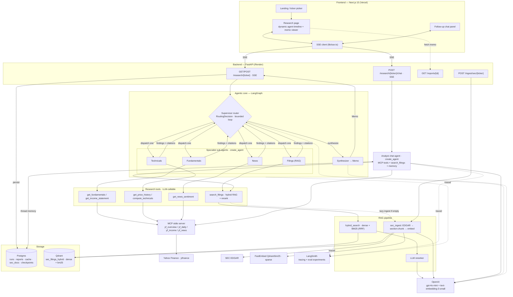

# FinSight — Architecture

FinSight turns a stock ticker into a structured, citation-grounded investment memo, and then
lets you ask follow-up questions about it. This document describes how the system is built.

- **Frontend:** Next.js 15 (App Router) on Vercel.
- **Backend:** FastAPI on Render, orchestrating agents with **LangGraph** + **OpenAI**.
- **Retrieval:** hybrid (dense + BM25) RAG over SEC filings in **Qdrant**, with an LLM reranker.
- **Tools/data:** a real **MCP** server exposes market data (Yahoo Finance); SEC data from EDGAR.
- **State/memory:** **Postgres** (runs, reports, cache, filing metadata, LangGraph checkpoints).
- **Observability:** **LangSmith** tracing + an evaluation suite.

> Scope: a portfolio/showcase project. The goal is production-shaped architecture, not
> prediction accuracy or investment advice.

---

## 1. High-level architecture



---

## 2. Request flows

### 2.1 Research run (ticker → memo)
`routers/research.py` — `GET/POST /research/{ticker}` (Server-Sent Events).

1. Validate ticker; insert a `runs` row (`status=running`) and mint a `thread_id` (= run id).
2. Build the LangGraph and stream it (`agents/graph.py::stream_run`).
3. The **supervisor** decides the next step each turn (LLM → `RoutingDecision`), dispatching one
   specialist at a time or choosing `synthesize`. The loop is bounded by `MAX_DISPATCHES` (6).
4. Each **specialist** (a tool-calling `create_agent`) runs its tools and returns a *finding*;
   the **filings** specialist also collects `SECCitation`s.
5. When the supervisor stops, the **synthesizer** makes one structured pass → a strict-JSON `Memo`
   grounded in the accumulated findings + citations.
6. Persist a `reports` row + finalize the `runs` row; emit SSE events throughout:
   `start`, `supervisor_decision`, `specialist_done`, `final`.

The UI renders a **dynamic timeline** from `supervisor_decision`/`specialist_done` (the sequence
is decided at runtime, not fixed), then the structured memo.

### 2.2 Follow-up chat (memo → answers)
`routers/chat.py` — `POST /research/{ticker}/chat` (SSE).

1. Load the memo for the `thread_id` (seed context).
2. Open an MCP session, load the MCP tools (`langchain-mcp-adapters`) + a ticker-bound
   `search_filings` tool.
3. Build the **analyst** agent (`agents/analyst.py`, LangChain `create_agent`) with an
   `AsyncPostgresSaver` checkpointer keyed by `thread_id` → durable conversation memory.
4. Stream `astream_events`: `tool` events (which tool the LLM chose) + `token` deltas.

### 2.3 SEC ingestion (documents → vectors)
`services/sec_ingest.py`, triggered by `POST /ingest/sec/{ticker}`, the nightly APScheduler job,
or lazily by `search_filings` on first use of an un-indexed ticker.

`ticker → CIK → recent 10-K/10-Q → fetch HTML → section-aware chunk → embed (dense + sparse) →
upsert to Qdrant → record in sec_docs`. Idempotent (skips filings already ingested by accession).

---

## 3. Components

### 3.1 Agentic core (`finsight/agents/`)
- **`supervisor.py`** — `route(state) → RoutingDecision{next, task, reason}` via
  `llm.chat_structured`. The LLM chooses the next specialist (or `synthesize`) and can react to
  findings. The **dispatch cap lives in the graph**, never the model.
- **`graph.py`** — `build_graph()` wires a `StateGraph`: `supervisor` → conditional edge to a
  specialist (each loops back to `supervisor`) or to `synthesizer` → `END`. `_supervisor_node`
  enforces `MAX_DISPATCHES`. `stream_run()` yields `(node, partial)` updates for the SSE layer.
- **`specialists.py`** — `run_specialist(name, ticker, task)` builds a `create_agent` per
  dispatch (focused system prompt + a tool subset), returns `(finding_text, citations)`.
  Specialists: `fundamentals`, `technicals`, `news`, `filings`.
- **`synthesizer.py`** — `run(state) → {final_memo}`: dedupes citations, formats them, and makes
  one `chat_structured(schema=Memo)` call. Keeps the `Memo` contract for the UI + eval.
- **`state.py`** — `ResearchState` (TypedDict) with `findings`/`citations`/`errors`
  append-reducers and the supervisor control channel (`next_agent`, `dispatch_count`, …), plus the
  typed payload models (`MarketSnapshot`, `QuantSignals`, `NewsBundle`, `SECCitation`, `Finding`).
- **`memo_schema.py`** — the `Memo` output contract (recommendation, conviction 1–5, 2–5
  bull/bear `Argument`s with `citation_ids`, 1–6 `Risk`s, key metrics, catalysts).
- **`analyst.py`** — the follow-up chat agent factory + the ticker-bound `search_filings` tool and
  `summarize_memo` seed.
- `market.py` / `quant.py` / `news.py` are now **pure helper modules** (parse Yahoo responses,
  compute indicators) reused by the tools — they are no longer graph nodes.

### 3.2 Tools & MCP (`finsight/tools/`, `finsight/mcp_servers/`)
- **`research_tools.py`** — LangChain `@tool`s bound per ticker: `get_fundamentals`,
  `get_income_statement`, `get_price_history`, `compute_technicals`, `get_news_sentiment`
  (all via the MCP server), and `search_filings` (hybrid retrieve + rerank). A run-scoped
  `ContextVar` **citation sink** lets `search_filings` collect `SECCitation`s so the synthesizer
  can ground `citation_ids`.
- **`mcp_servers/yfinance_server.py`** — a real **stdio MCP server** exposing four tools
  (`yf_overview`, `yf_daily`, `yf_income_statement`, `yf_news_sentiment`) backed by **Yahoo Finance**.
- **`mcp_client.py`** — spawns the MCP server as a subprocess and re-exposes its tools. It passes
  `env=dict(os.environ)` so the subprocess shares the API's config (DB URL, cache dir).
- **`tools/yfinance_client.py`** — the market-data client (**yfinance**, run in threads),
  returning the dict shapes the parsers expect. Endpoints wrapped by reliability decorators.
- **`tools/base.py`** — decorator stack `cached → rate_limited → with_retry → raw`. Cache hits
  cost zero tokens; retries can't double-spend the rate-limit bucket.
- **`tools/edgar.py`** — SEC EDGAR client (ticker→CIK, recent filings, document fetch).

### 3.3 RAG (`finsight/services/`)
- **`chunker.py`** — section-aware chunking of 10-K/10-Q HTML (Risk Factors, MD&A, Market Risk, …)
  into ~800-token windows with overlap.
- **`vectorstore.py`** — Qdrant wrapper. Collection `sec_filings_hybrid` holds **two named
  vectors** per chunk: `dense` (OpenAI, cosine) and `bm25` (sparse, `Modifier.IDF`).
  `hybrid_search()` runs both branches and fuses them with **RRF**; `search()` is dense-only
  (kept for the hybrid-vs-dense eval). Sparse vectors come from **FastEmbed `Qdrant/bm25`**.
- **`reranker.py`** — a listwise **LLM reranker** (`gpt-4o-mini`) that reorders the candidate pool
  by relevance; degrades gracefully to fusion order on error.
- **`sec_ingest.py`** — the ingestion pipeline (see §2.3).

### 3.4 LLM access (`finsight/services/llm.py`)
A single `AsyncOpenAI` client with `chat`, `chat_structured` (Pydantic strict-schema),
`stream_chat`, and `embed`. When tracing is on, the client is wrapped with
`langsmith.wrappers.wrap_openai` so every call is traced.

### 3.5 API & app lifecycle
- Routers: `research.py`, `chat.py`, `reports.py`, `ingest.py`.
- `main.py` lifespan: ensure the Qdrant collection, export LangSmith env (if enabled), open the
  `AsyncPostgresSaver` checkpointer (held for app lifetime), start the scheduler.
- `jobs/scheduler.py`: nightly re-ingest of recently-researched tickers (idempotent).

### 3.6 Frontend (`apps/web/`)
- `app/page.tsx` — landing / ticker entry.
- `app/research/[ticker]/page.tsx` — opens an `EventSource`, builds the **dynamic** timeline from
  supervisor/specialist events, renders `components/memo-viewer.tsx`, and mounts
  `components/memo-chat.tsx` once the memo + `thread_id` arrive.
- `lib/sse.ts` — a fetch-based SSE reader (handles CRLF frames) used by the follow-up chat POST.

---

## 4. Data & storage

**Postgres** (`db/models.py`):
- `runs` — one row per research invocation (status, timings, `thread_id`, error snapshot).
- `reports` — the final memo JSONB (+ `thread_id`).
- `cache` — generic TTL KV used by the `@cached` tool decorator.
- `rate_limit_buckets` — persisted token-bucket state.
- `sec_docs` — system-of-record for ingested filings (vectors live in Qdrant).
- LangGraph checkpoint tables — created by `AsyncPostgresSaver` (conversation memory).

**Qdrant**: collection `sec_filings_hybrid`, named vectors `dense` (1536-d cosine) + `bm25`
(sparse, IDF), payload-filtered by `ticker`/`section`/`accession`.

**Models**: `gpt-4o-mini` (all agents + reranker + judges), `text-embedding-3-small` (dense RAG),
FastEmbed `Qdrant/bm25` (sparse).

---

## 5. Observability & evaluation

- **Tracing (LangSmith):** `wrap_openai` on the OpenAI singleton + `@traceable` on
  `supervisor.route`, `synthesizer.run`, `reranker.rerank`, and `MCPClient.call`. With LangGraph
  and `create_agent` auto-tracing, each run is one trace tree (decisions → specialists → tool
  calls → synthesizer) with per-span tokens/latency. Gated behind `LANGSMITH_TRACING` (no-op off).
- **Evaluation (`apps/api/evals/`):**
  - Deterministic validators (`validators.py`) + `tests/` (quant golden values, reranker uplift,
    supervisor routing/cap, memo/citation validity) — run in `pytest`, no keys.
  - LangSmith datasets + `evaluate()` (`run_evals.py`) with three suites: **RAG**
    (precision@k, hybrid uplift, groundedness), **memo** (schema, citation validity, trajectory
    coverage, faithfulness), **analyst** (tool-selection, answer groundedness). Code evaluators are
    objective; LLM-judge evaluators are directional.

See the eval reading guide in the repo notes: metrics live under LangSmith **Datasets &
Experiments** (`finsight-rag` / `finsight-memos` / `finsight-analyst`); traces under
**Projects → finsight**.

---

## 6. Key design decisions

- **Agentic where it earns its keep.** The research run is a supervisor-driven agent (open-ended:
  it decides what to gather and when to stop). The output stays a **structured `Memo`** so the UI
  and evals have a stable contract. Follow-ups are a separate ReAct agent (open-ended Q&A).
- **Loop budget in the graph, not the model.** `MAX_DISPATCHES` bounds cost/latency; an LLM that
  sets its own retry budget is a liability.
- **Hybrid + rerank retrieval.** Dense recall + BM25 lexical (exact terms like "Item 1A") fused by
  RRF, then reranked — the standard retrieve-then-rerank quality bar.
- **Real MCP boundary.** Market data is a real MCP server, so the same tools work in Claude
  Desktop/Cursor, and the data source lives behind the tool boundary.
- **Grounded citations.** `citation_ids` are 1-based indices into collected evidence (not URLs the
  model could hallucinate); validated by an eval.
- **Reliability decorators** (`cached → rate_limited → with_retry`) compose uniformly over tools.

---

## 7. Deployment

- **Frontend** → Vercel (`apps/web`), `NEXT_PUBLIC_API_URL` → the Render backend.
- **Backend** → Render web service from `render.yaml` (`apps/api/Dockerfile`).
- **Postgres** → Supabase (pooler URL). **Qdrant** → Qdrant Cloud.
- **Local** → `docker compose up` (postgres + qdrant + api); `entrypoint.sh` runs Alembic
  migrations then uvicorn. Web via `npm run dev`.

Configuration is centralized in `finsight/settings.py` (pydantic-settings); see `.env.example`.
Market data (Yahoo Finance) needs no key; `OPENAI_API_KEY` and `SEC_USER_AGENT` are required,
`LANGSMITH_*` optional (required for tracing/evals).

---

## 8. Known limitations

- **yfinance is unofficial** (scrapes Yahoo) — occasionally flaky; fine for a demo, not for prod.
- **Eval datasets are tiny** (2–4 examples) — good for smoke/regression, not statistical claims;
  RAG gold labels are keyword+section heuristics.
- **The persisted rate limiter** is currently a light guard; it does not actively throttle in all
  paths. Yahoo has no hard per-key quota, so this rarely bites, but it's a known gap.
- **News has no sentiment scores** (Yahoo provides headlines only) — the News specialist reports
  headlines; aggregate sentiment is neutral/unknown.
- Not investment advice; accuracy is out of scope.

---

## 9. Repo layout

```
finsight/
├── apps/
│   ├── api/                         # FastAPI + LangGraph + MCP
│   │   ├── finsight/
│   │   │   ├── agents/              # supervisor, specialists, synthesizer, analyst, graph, state, memo_schema
│   │   │   ├── mcp_servers/         # yfinance_server (stdio MCP; Yahoo Finance)
│   │   │   ├── tools/               # research_tools, mcp_client, yfinance_client, edgar, base
│   │   │   ├── services/            # vectorstore (hybrid), reranker, llm, chunker, sec_ingest, cache, rate_limit
│   │   │   ├── routers/             # research (SSE), chat (SSE), reports, ingest
│   │   │   ├── jobs/                # apscheduler
│   │   │   ├── db/                  # models, client
│   │   │   └── prompts/
│   │   ├── evals/                   # validators, evaluators, datasets, run_evals
│   │   └── tests/                   # reranker, supervisor, quant, memo-validation
│   └── web/                         # Next.js 15 (App Router)
├── docker-compose.yml               # postgres + qdrant + api (local)
├── render.yaml                      # backend deploy
├── ARCHITECTURE.md                  # this document
└── README.md
```
