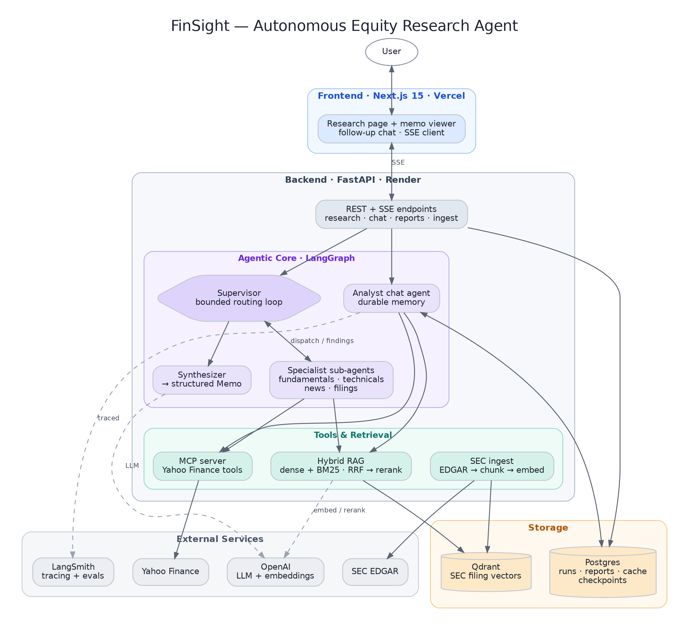
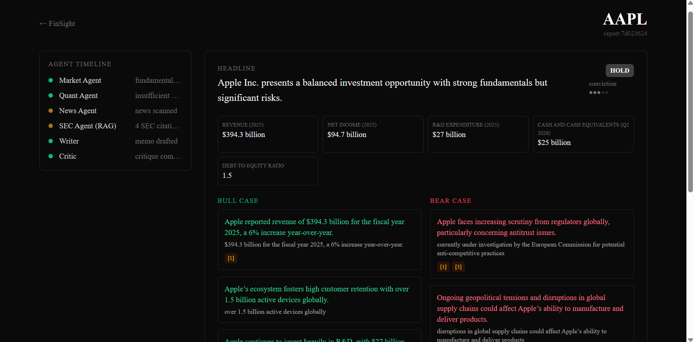
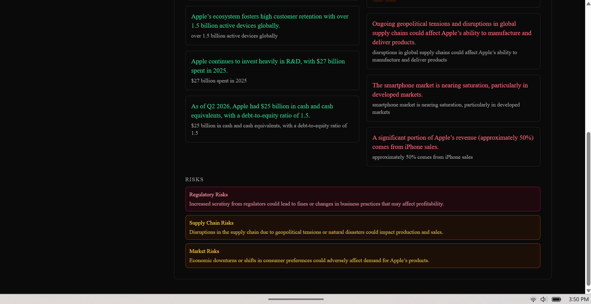

# FinSight — Autonomous Equity Research Agent

An agentic AI system that turns a stock ticker into a structured investment memo — and then answers follow-up questions about it.

Built to demonstrate production AI engineering for an AI Engineer role:

- **Agentic orchestration** — a LangGraph **supervisor** dynamically dispatches specialist sub-agents (fundamentals · technicals · news · filings) in a runtime-decided, bounded loop, then synthesizes the memo. The control flow is model-driven, not a hardcoded pipeline.
- **MCP** (Model Context Protocol) server exposing market data (Yahoo Finance) as tools
- **Hybrid RAG** over SEC 10-K / 10-Q filings — dense (OpenAI) **+ sparse BM25** fused with RRF in Qdrant, then an **LLM reranker** (EDGAR → section-aware chunk → embed → retrieve → rerank → cite)
- **Conversational follow-ups** — a tool-calling analyst agent with **durable memory** (LangGraph Postgres checkpointer) answers questions on the generated memo
- **Streaming UI** — SSE from FastAPI to Next.js; the live timeline shows the supervisor's actual decisions
- **Production hygiene** — Postgres-backed cache + persisted token-bucket rate limits, idempotent SEC ingestion, Dockerized, Render + Vercel deploy

> **Scope:** portfolio / showcase project. The goal is architecture quality, not prediction accuracy.

---

## Architecture



```
Next.js 15 (Vercel) ──SSE──▶ FastAPI (Render) ──▶ LangGraph supervisor
                                                        │  (LLM decides next step, bounded loop)
                                   ┌────────────────────┼────────────────────┐
                                   ▼                    ▼                     ▼
                             Fundamentals          Technicals             News          Filings
                             sub-agent             sub-agent           sub-agent       sub-agent
                                   │                    │                  │              │
                             get_fundamentals    get_price_history   get_news_    search_filings
                             get_income_stmt     compute_technicals  sentiment    (hybrid RAG +
                             (MCP · Yahoo)       (MCP + pandas)       (MCP)         rerank · Qdrant)
                                   └──── findings + citations ──▶ supervisor ◀── loops until "synthesize"
                                                        │
                                                   Synthesizer ─► structured Memo (grounded citations)
                                                        │
                                          Follow-up chat agent (tools + Postgres-checkpointer memory)
```

Each specialist is itself a tool-calling `create_agent`; the supervisor reacts to
what it learns (e.g. news surfaces a lawsuit → dispatch the filings agent for
legal proceedings). Initial memo research is agentic; the memo output stays a
strict-JSON `Memo` for the UI + grounding.

Cross-cutting:

- **Storage:** Postgres (runs, reports, cache, sec_docs, LangGraph checkpoints) + Qdrant (`sec_filings_hybrid`: dense + BM25 sparse vectors)
- **Cache:** Postgres KV with TTL per tool
- **Rate limits:** persisted token bucket survives restarts
- **Models:** `gpt-4o-mini` (agents) + `text-embedding-3-small` (dense RAG) + FastEmbed `Qdrant/bm25` (sparse)

---

## Example output

A generated memo for **AAPL** — agent timeline, recommendation + conviction, key metrics, and bull/bear cases with SEC citations:



Citation-grounded bull/bear arguments and severity-tagged risks:



---

## What's interesting (for an interview)

### 1. Genuinely agentic control flow — not a fixed pipeline
A LangGraph **supervisor** ([agents/supervisor.py](apps/api/finsight/agents/supervisor.py)) decides at each step which specialist to dispatch (or to stop and synthesize), and reacts to what it finds. The specialists ([agents/specialists.py](apps/api/finsight/agents/specialists.py)) are tool-calling `create_agent` sub-agents. The **dispatch cap lives in the graph** (`MAX_DISPATCHES` in [agents/graph.py](apps/api/finsight/agents/graph.py)), not the model — an LLM that can decide its own loop budget is a liability.

### 2. Real MCP server — not a hand-rolled wrapper
[apps/api/finsight/mcp_servers/yfinance_server.py](apps/api/finsight/mcp_servers/yfinance_server.py) is a real stdio MCP server using Anthropic's `mcp` SDK, exposing four tools (`yf_overview`, `yf_daily`, `yf_income_statement`, `yf_news_sentiment`) backed by Yahoo Finance. The specialists reach it through the research tools in [tools/research_tools.py](apps/api/finsight/tools/research_tools.py) — the same protocol Claude Desktop or Cursor would use. You can also drop it into Claude Desktop directly:

```json
{
  "mcpServers": {
    "yahoo-finance": {
      "command": "python",
      "args": ["-m", "finsight.mcp_servers.yfinance_server"]
    }
  }
}
```

### 3. Hybrid retrieval + reranking
SEC filings are chunked by recognized 10-K sections ([services/chunker.py](apps/api/finsight/services/chunker.py)) and indexed with **both** a dense OpenAI embedding and a sparse BM25 vector. `search_filings` runs both and fuses them with RRF in Qdrant ([services/vectorstore.py](apps/api/finsight/services/vectorstore.py) `hybrid_search`), then an **LLM reranker** ([services/reranker.py](apps/api/finsight/services/reranker.py)) reorders the pool by relevance. Dense alone misses exact lexical hits (defined terms, "Item 1A"); the sparse branch catches them. Memo citations are 1-based indices into the collected evidence, so the model can't hallucinate URLs.

### 4. Grounded synthesis + conversational memory
The synthesizer ([agents/synthesizer.py](apps/api/finsight/agents/synthesizer.py)) makes one structured pass into a strict-JSON `Memo` ([agents/memo_schema.py](apps/api/finsight/agents/memo_schema.py)), grounded in the citations the filings agent collected. Afterwards, a follow-up analyst agent ([agents/analyst.py](apps/api/finsight/agents/analyst.py)) answers questions on the memo — it picks tools itself (e.g. `yf_income_statement`) and remembers the conversation via a LangGraph **Postgres checkpointer** keyed by `thread_id`.

### 5. MCP-style decorators on every tool
Caching, rate-limiting, and retry are decorator composition ([tools/base.py](apps/api/finsight/tools/base.py)). Order matters: `cached → rate_limited → with_retry → raw call`. Cache hits cost zero tokens; retries can't double-spend the rate-limit bucket.

---

## Repo layout

```
finsight/
├── apps/
│   ├── api/                        # FastAPI + LangGraph + MCP servers
│   │   └── finsight/
│   │       ├── agents/             # supervisor, specialists, synthesizer, analyst + graph, state, memo_schema
│   │       │                       #   (quant/market/news kept as parse/compute helpers)
│   │       ├── mcp_servers/        # yfinance_server (MCP stdio)
│   │       ├── tools/              # research_tools (agent tools), mcp_client, yfinance_client, edgar, base
│   │       ├── services/           # vectorstore (hybrid), reranker, llm, chunker, sec_ingest, cache, rate_limit
│   │       ├── routers/            # research (SSE), chat (follow-up SSE), reports, ingest
│   │       ├── jobs/               # apscheduler
│   │       ├── db/                 # models, client
│   │       └── prompts/
│   ├── api/tests/                  # reranker, supervisor-routing, quant golden-value tests
│   └── web/                        # Next.js 15 (App Router)
│       └── app/research/[ticker]/  # streaming research page + dynamic agent timeline + follow-up chat
├── docker-compose.yml              # postgres + qdrant + api (local)
├── render.yaml                     # backend deploy
└── apps/web/vercel.json            # frontend deploy
```

---

## Quickstart

```bash
cp .env.example .env
# Fill in OPENAI_API_KEY at minimum (market data via Yahoo Finance needs no key).

# 1. Start Postgres + Qdrant
docker compose up -d postgres qdrant

# 2. Start the API (runs alembic migrations then uvicorn)
docker compose up api

# 3. Start the frontend
cd apps/web
npm install
npm run dev
```

Open <http://localhost:3000/research/AAPL>. The first request for a ticker auto-ingests its SEC filings (one-time, idempotent); subsequent runs hit the cache.

### Manual SEC ingestion

```bash
curl -X POST http://localhost:8000/ingest/sec/AAPL
curl http://localhost:8000/ingest/sec/AAPL/status
```

---

## Environment

See [.env.example](.env.example). Minimum:

| Var | Purpose |
|---|---|
| `OPENAI_API_KEY` | LLM + embeddings |
| `SEC_USER_AGENT` | EDGAR requires identifying header (`Name email@example.com`) |
| `DATABASE_URL` / `DATABASE_URL_SYNC` | Postgres (asyncpg / psycopg2 URLs) |
| `QDRANT_URL` | Qdrant (Cloud or self-hosted) |

---

## Deployment

- **Frontend** → Vercel (autodetects `apps/web`). Set `NEXT_PUBLIC_API_URL` to the Render URL.
- **Backend** → Render web service from [render.yaml](render.yaml) (`apps/api/Dockerfile`). Set all env vars listed in `render.yaml` via the Render dashboard.
- **Postgres** → Supabase free tier (use the pooler URL).
- **Qdrant** → Qdrant Cloud free tier (1GB cluster).
